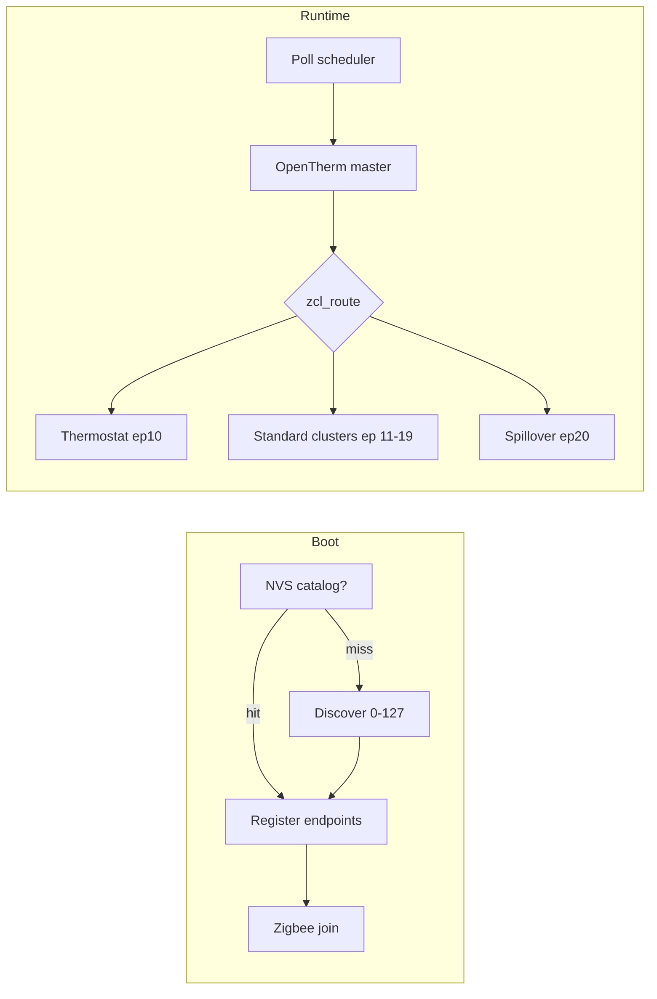

# v2: Layered OpenTherm Data ID → Zigbee mapping

**Status:** accepted (2026-07-02)  
**ADR:** [docs/adr/0002-layered-ot-zigbee-mapping.md](../docs/adr/0002-layered-ot-zigbee-mapping.md)  
**Glossary:** [CONTEXT.md](../CONTEXT.md)

## Goal

The bridge reads all **available Data IDs** from the boiler slave, exposes them on Zigbee (read continuously on change), and accepts writes for **master-writable** IDs — while keeping v1 Home Assistant Thermostat behavior.

## Decisions

| Topic | Choice |
|-------|--------|
| Zigbee surface | Hybrid: Thermostat + maximum standard ZCL clusters + spillover cluster |
| Duplication | Spillover-only — IDs with a standard cluster mapping are not duplicated on spillover |
| Discovery | Available = `READ-ACK` or `DATA_INVALID`; `UNKNOWN-DATAID` = unsupported |
| Polling | Tiered (fast ~1 s / slow ~60 s) + adaptive promotion on write or value change |
| Writes | OT-spec strict — master-writable IDs only; ID 0 via existing Thermostat paths |
| Standard mapping | Maximum ZCL coverage per spec table; spillover for OEM/diagnostic |
| Endpoints | Fixed Thermostat (10) + fixed spillover + discovery-driven standard endpoints |
| Catalog | NVS-cached; `RescanCatalog` / `ClearCatalog` ZCL manufacturer commands |
| Spillover encoding | Typed per OT spec table; `DATA_INVALID` → ZCL invalid sentinel |
| Validation | Boot + manual rescan only — no periodic background scan |

## Architecture



### Endpoint layout

| Endpoint | Content | When created |
|----------|---------|--------------|
| 10 | Thermostat + Basic | Always |
| 11–19 | Analog Input / Output / Multistate per mapped ID | Discovery-driven (available + standard mapping) |
| 20 | Spillover cluster + Basic + mfg commands | Always |

### Spec table row (`ot_data_catalog`)

Each spec ID 0–127:

```
{id, ot_type, poll_tier, writable, zcl_route}
```

`zcl_route` ∈ {Thermostat, AnalogInput, AnalogOutput, Multistate, Spillover, None}

## Implementation steps

### Phase 1 — OpenTherm data layer

1. Restore full `OpenThermMessageID` enum in `OpenTherm.h` (IDs 0–127).
2. Add generic OT accessors in `opentherm_wrapper`: `read_id()`, `write_id()`, response status enum.
3. Add `ot_data_catalog` spec table with type, tier, writability, and `zcl_route` per ID.
4. Add encoding helpers: f8.8 ↔ centi-int16, flag8, u16; invalid sentinel mapping.

**Verify:** serial harness can READ any ID.

### Phase 2 — Discovery engine

5. Implement `ot_discover_all()` — probe 0–127; classify available vs unknown.
6. Persist catalog to NVS (`version`, `id_list[]`, `timestamp`).
7. Load catalog on boot — full scan only if missing or after `ClearCatalog`.
8. Boot-time validation — re-probe cached IDs once; update NVS and endpoints if set changes.

**Verify:** first boot ~13 s scan; second boot instant; validation detects capability change.

### Phase 3 — Zigbee device model refactor

9. Generalize `zb_thermostat_ed` → `zb_ot_bridge`; model string `OT-ZB-Bridge-v2`.
10. Register fixed spillover endpoint (20) with Basic + spillover cluster skeleton.
11. Endpoint factory — `zb_add_discovery_endpoint(id, cluster_type)` for available standard-mapped IDs.
12. Defer `esp_zb_start()` until mandatory IDs 0+3 read and catalog ready.

**Verify:** ZHA sees ep 10 Thermostat, ep 20 spillover, dynamic sensor endpoints per catalog.

### Phase 4 — Standard cluster mappings

13. Extend Thermostat cluster — all IDs with ZCL Thermostat analogues.
14. Analog Input endpoints — f8.8 sensors (17, 18, 25–28, …) with `PresentValue` in centi-units.
15. Analog Output endpoints — master-writable non-Thermostat IDs (e.g. 14).
16. Multistate / other clusters — ID 4 remote commands, config bitfields, u16 counters.
17. Wire write callbacks — writable standard attrs → `write_id()` → adaptive promotion.

**Verify:** HA entities per mapped ID; writable IDs accept writes; read-only reject.

### Phase 5 — Spillover cluster

18. Define manufacturer cluster `0xFC01`: typed attributes keyed by OT ID (spillover route only).
19. Register read-only vs writable access per spec table.
20. Report-on-change for spillover attributes.
21. Manufacturer commands: `RescanCatalog` (0x00), `ClearCatalog` (0x01).

**Verify:** OEM IDs on spillover only; rescan/clear commands work from coordinator.

### Phase 6 — Poll engine

22. Replace `ot_poll_task` with tiered scheduler (fast / slow / promoted with decay ~5 min).
23. ID 0 special path — status READ with master flags each fast tick.
24. Change detection — raw value + validity; report invalid ↔ valid transitions.
25. Fan-out via `zcl_route` — no duplicate spillover reports.

**Verify:** Tboiler ~1 s; counters ~60 s; post-write fast polling then decay.

### Phase 7 — Integration & docs

26. Refactor `ot_bridge.c` — thin orchestration delegating to catalog, discovery, poll, zb.
27. Kconfig — GPIO, fast/slow intervals, promotion decay, spillover endpoint ID.
28. OKF playbooks — discovery, endpoints, spillover encoding, catalog commands, poll tiers.
29. HA quirk snippet (docs) — `RescanCatalog` / `ClearCatalog` for ZHA.
30. End-to-end test checklist — join, control, read all available, write writable, rescan/clear.

**Verify:** v1 HA behavior unchanged for ID 0/1/25; full checklist on real boiler.

## Out of scope (v2)

- IDs 128–255 (test & diagnostic; members only)
- Periodic automatic catalog rescan
- Physical button trigger for catalog clear
- Zigbee2MQTT converter (document only; implement if needed later)
